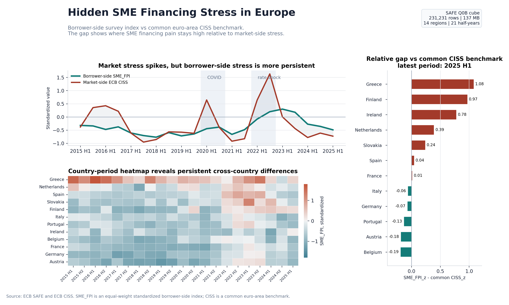
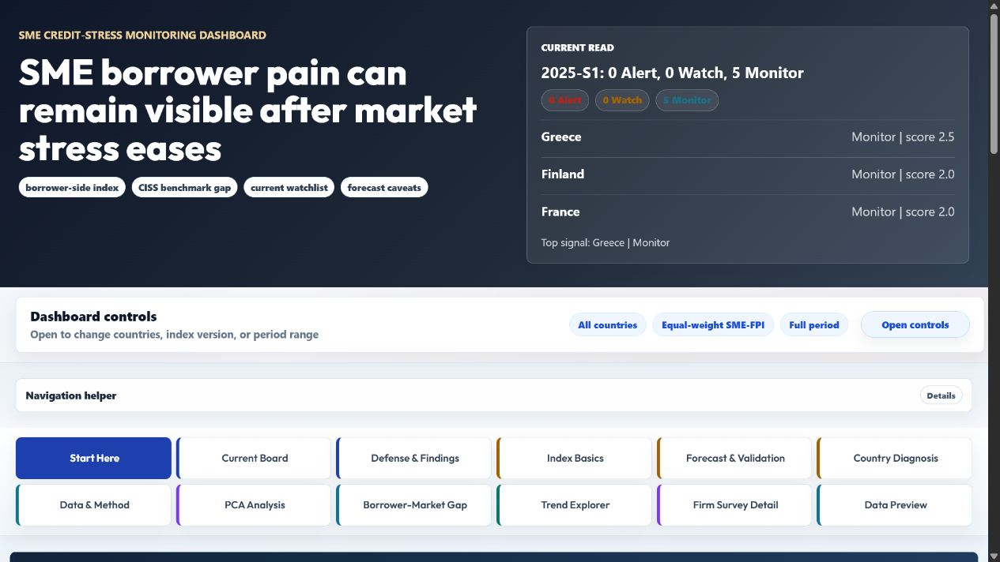
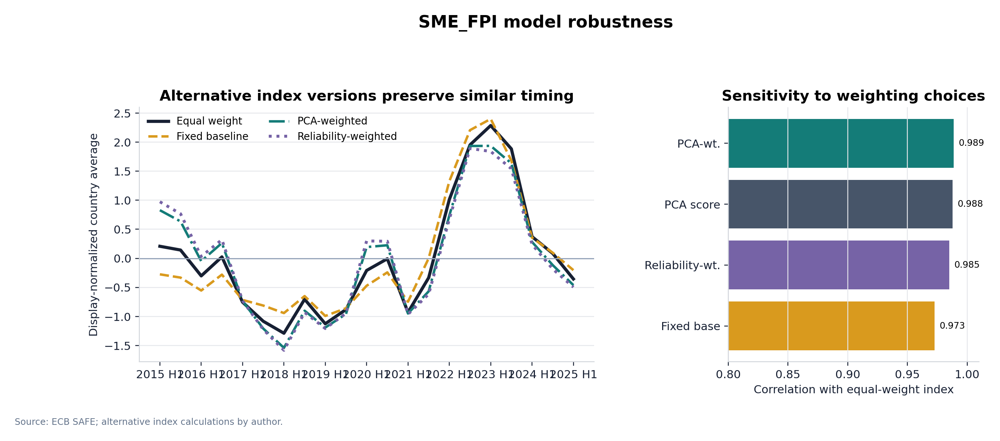
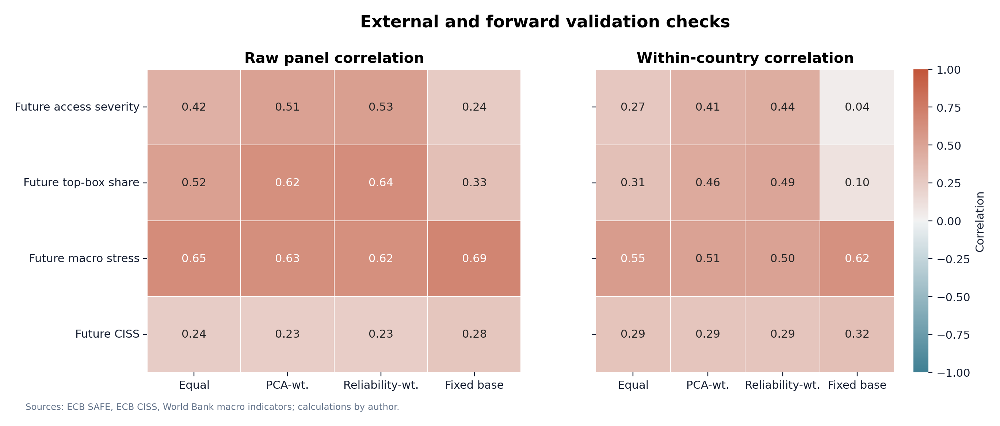
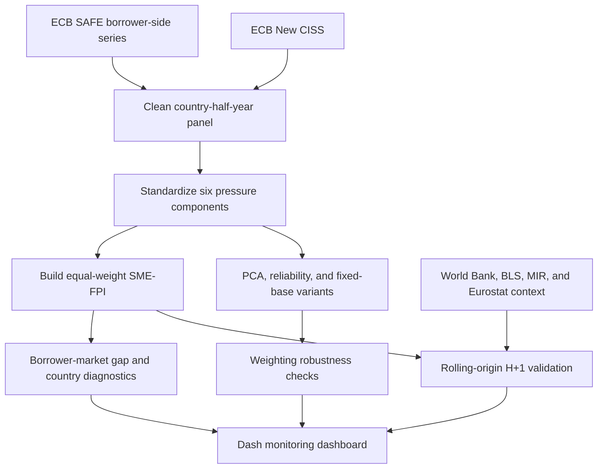

# SME Financing Pain Index

[](https://github.com/YoungJun0814/SME-Financing-Pain-Index/actions/workflows/tests.yml)
[](requirements.txt)
[](dashboard/README.md)
[](DATA_ATTRIBUTION.md)
[](LICENSE)

A borrower-side SME financing stress index for Europe, built from ECB SAFE survey signals and compared with the ECB New CISS market-stress benchmark. The project combines index construction, robustness testing, Big Data visualization, rolling-origin validation, and an interactive monitoring dashboard.

**Project outputs:** [dashboard guide](dashboard/README.md) | [executed notebook](notebooks/BigData_SME_FPI_Portfolio.ipynb) | [methodology](reports/SME_FPI_v2_methodology.md) | [technical review](reports/technical_theoretical_review.md) | [data attribution](DATA_ATTRIBUTION.md)



*The headline view contrasts the borrower-side index with the common euro-area CISS benchmark and ranks the latest relative gaps. A positive gap means SME financing pain is elevated relative to market stress; it is not proof of country-level systemic stress.*

## Research Question

> Can a borrower-side SME Financing Pain Index reveal European SME credit stress that is not fully captured by a common market-side stress indicator such as the ECB New CISS?

## Project at a Glance

| Item | Design |
|---|---|
| Core index panel | 386 country-half-year observations across 12 countries, 2009-S1 to 2025-S1 |
| Big Data layer | 231,231-row SAFE Q0B survey cube for problem, firm-size, sector, and period analysis |
| Index inputs | Six borrower-side SAFE financing-pressure indicators |
| Benchmark | Common euro-area ECB New CISS, aggregated to half-years |
| Robustness | Equal-weight, fixed-baseline, PCA-weighted, and reliability-weighted indices |
| Validation | Future SAFE outcomes, World Bank macro context, and 24 rolling forecast origins |
| Delivery | Dash monitoring dashboard, executed notebook, static figures, and processed datasets |

## Key Findings

- In 2025-S1, Greece, Finland, and Ireland have the largest positive borrower-market gaps at 1.08, 0.97, and 0.78 standardized points, respectively.
- The four index variants preserve very similar timing: their correlations with the equal-weight index range from 0.973 to 0.989.
- The equal-weight index is persistent one half-year ahead (Pearson correlation 0.893), while its correlations with future access-finance severity outcomes are more moderate (0.421-0.522). This supports monitoring relevance but not strong predictive or causal claims.
- A machine-learning model is best at 18 of 24 rolling origins. Its median MAE edge over the strongest simple benchmark is only 0.036 standardized index points, so the forecast layer is treated as supporting evidence rather than the main result.
- The latest decision board contains five `Monitor` signals and no `Alert` or `Watch` signals. These tiers organize analyst attention; they are not default probabilities or official warnings.

## Index Design

For country `c`, half-year `t`, and the `K = 6` available borrower-side components, the transparent core index is

$$
\mathrm{SME\_FPI}_{c,t}=\frac{1}{K}\sum_{k=1}^{K}z_{k,c,t}.
$$

The dashboard's relative borrower-market gap is

$$
\mathrm{Gap}_{c,t}=\mathrm{SME\_FPI}_{c,t}-\mathrm{CISS}_{t}^{z}.
$$

A higher SME-FPI means more reported financing pain. CISS is a common euro-area benchmark, so the gap is a relative diagnostic, not a country-specific market-stress estimate.

## Dashboard Preview



The dashboard opens with the latest monitoring board, guided navigation, and controls for country, index version, and period. It separates the descriptive core index from the forecast-only predictor stack so users can see which evidence supports each claim.

### Dashboard Reading Path

1. **Start Here:** project claim, glossary, and five-minute path.
2. **Current Board:** latest monitoring tier, signal type, model agreement, and country drivers.
3. **Borrower-Market Gap:** countries where borrower-side pain exceeds the common CISS benchmark.
4. **Forecast & Validation:** H+1 loss, benchmark comparisons, rank stability, and country errors.
5. **Data & Method:** source roles, data lineage, design safeguards, and limitations.

The remaining tabs provide trend exploration, index construction, PCA diagnostics, detailed survey views, country evidence cards, and raw/processed data previews.

## Robustness and Validation



*Alternative weighting choices change index levels slightly but preserve the broad timing of stress. High agreement across variants is a robustness check, not independent external validation.*



*Raw and within-country correlations are reported separately. The latter reduce the influence of persistent cross-country level differences, but neither design identifies a causal effect.*

Machine-readable validation outputs are available in [`data/processed/validation_results.csv`](data/processed/validation_results.csv), while the full rolling-origin comparison is stored in [`data/processed/forecasting_model_evaluation.csv`](data/processed/forecasting_model_evaluation.csv).

## Analytical Workflow



## What This Project Does

- Builds a transparent SME Financing Pain Index from six ECB SAFE borrower-side variables.
- Compares borrower-side SME financing pain with the ECB New CISS market-stress benchmark.
- Tests equal-weight, fixed-baseline, PCA-weighted, and reliability-weighted designs.
- Uses PCA correlation circles, KMeans clustering, elbow diagnostics, and silhouette diagnostics.
- Uses a 231,231-row ECB SAFE Q0B survey cube for Big Data visualization and robustness checks.
- Adds macro context and forward validation using World Bank indicators and future SAFE outcomes.
- Adds an early-warning layer using SAFE micro diagnostics, ECB BLS lender signals, ECB MIR loan data, Eurostat business statistics, and macro context.
- Provides current monitoring tiers, country diagnosis cards, forecast audit views, and data-preview tools in Dash.

## Main Outputs

| Output | Description |
|---|---|
| [`dashboard/app.py`](dashboard/app.py) | Interactive SME Financing Pain Observatory built with Dash and Plotly. |
| [`notebooks/BigData_SME_FPI_Portfolio.ipynb`](notebooks/BigData_SME_FPI_Portfolio.ipynb) | Executed notebook with code, outputs, chart rationale, and dashboard companion evidence. |
| [`data/processed/sme_fpi_panel_v2.csv`](data/processed/sme_fpi_panel_v2.csv) | Country-half-year panel with index versions, PCA, clusters, CISS, and relative gaps. |
| [`data/processed/forecast_decision_board.csv`](data/processed/forecast_decision_board.csv) | Latest risk tier, signal type, agreement quality, and driver summary by country. |
| [`data/processed/forecasting_feature_panel.csv`](data/processed/forecasting_feature_panel.csv) | Expanded forecast panel with macro, micro, BLS, MIR, Eurostat, and lagged predictors. |
| [`data/processed/forecasting_model_evaluation.csv`](data/processed/forecasting_model_evaluation.csv) | Rolling-origin H+1 model and benchmark evaluation. |
| [`data/processed/safe_problem_severity_cube.csv`](data/processed/safe_problem_severity_cube.csv) | Big-cube severity, top-box, and high-pressure measures. |
| [`reports/data_dictionary_v2.md`](reports/data_dictionary_v2.md) | Processed-data dictionary. |

## Data Sources

- ECB Survey on the Access to Finance of Enterprises (SAFE).
- ECB New Composite Indicator of Systemic Stress (New CISS).
- ECB Bank Lending Survey (BLS): SME credit standards, demand, terms, and rejection signals.
- ECB MFI Interest Rate Statistics (MIR): small and large corporate loan rates and small-loan volumes.
- Eurostat business statistics: bankruptcy declarations and business registrations indices.
- World Bank indicators: GDP growth, unemployment, inflation, and private-sector credit.

See [DATA_ATTRIBUTION.md](DATA_ATTRIBUTION.md) for provider links and reuse notes.

## Repository Structure

```text
.
|-- dashboard/                 # Interactive monitoring and diagnostic application
|-- notebooks/                 # Executed portfolio notebook
|-- data/
|   |-- processed/             # Index, validation, forecast, and dashboard-ready outputs
|   `-- raw/                   # Downloaded source inputs, excluding the large Q0B cache
|-- figures/                   # Static and interactive visualization outputs
|-- reports/                   # Methodology, dictionary, review, and SQL artifacts
|-- scripts/                   # Reproducible data and figure pipeline
|-- tests/                     # Dashboard, source, and generated-view smoke tests
|-- requirements.txt
`-- README.md
```

## Quick Start

Python 3.11 or 3.12 is recommended. Run from the repository root:

```bash
git clone https://github.com/YoungJun0814/SME-Financing-Pain-Index.git
cd SME-Financing-Pain-Index
python -m venv .venv
```

Activate the environment:

```bash
# Windows PowerShell
.venv\Scripts\Activate.ps1

# macOS or Linux
source .venv/bin/activate
```

Install dependencies and launch the dashboard:

```bash
python -m pip install --upgrade pip
python -m pip install -r requirements.txt
python dashboard/app.py
```

Open `http://127.0.0.1:8050`. If that port is busy, run `python dashboard/run_8051.py` and open `http://127.0.0.1:8051`.

Open the notebook with:

```bash
python -m jupyter notebook notebooks/BigData_SME_FPI_Portfolio.ipynb
```

## Reproducible Pipeline

The scripts are numbered in dependency order:

```bash
python scripts/01_download_data.py
python scripts/02_build_panel.py
python scripts/06_build_big_cube.py
python scripts/09_build_external_validation.py
python scripts/10_download_forecasting_data.py
python scripts/11_build_forecasting_layer.py
python scripts/03_generate_figures.py
python scripts/07_generate_polished_figures.py
python scripts/08_generate_signature_visual.py
python scripts/05_create_sqlite_demo.py
python scripts/04_create_bigdata_notebook.py
```

The raw SAFE Q0B cube is about 131 MB and is intentionally excluded from GitHub. Regenerate `data/raw/safe_q0b_pressingness_big_cube.csv` with `python scripts/06_build_big_cube.py`; processed derivatives are included where practical.

Run the focused test suite with:

```bash
python -m pip install -r requirements-dev.txt
python -m pytest -q
```

## Interpretation Limits

- The index is descriptive and correlational, not causal.
- SAFE measures reported borrower-side conditions and remains subject to survey design and response error.
- CISS is a common euro-area benchmark, not a country-specific SME credit variable.
- A positive relative gap does not prove local systemic or financial-market stress.
- Q0B severity uses ordinal responses, so top-box and high-pressure shares are retained as robustness measures.
- World Bank variables are annual and provide broad context rather than high-frequency validation.
- BLS, MIR, Eurostat, and detailed survey predictors belong to the forecast layer, not the core SME-FPI formula.
- Rolling-origin gains are small and unstable across periods; this is an early-warning experiment, not a production credit-risk model.
- Monitoring tiers prioritize review and should not be interpreted as probabilities, official alerts, or investment advice.

## Troubleshooting

- If an import fails, install `requirements.txt` again in the environment that runs the dashboard.
- If styles look stale, hard-refresh the browser tab.
- If port `8050` is occupied, use `python dashboard/run_8051.py`.
- If the large SAFE cube is absent, regenerate it; the dashboard normally reads the committed processed files.

## License

Project code is released under the [MIT License](LICENSE). Source and derived data remain subject to their original providers' terms; see [DATA_ATTRIBUTION.md](DATA_ATTRIBUTION.md).
